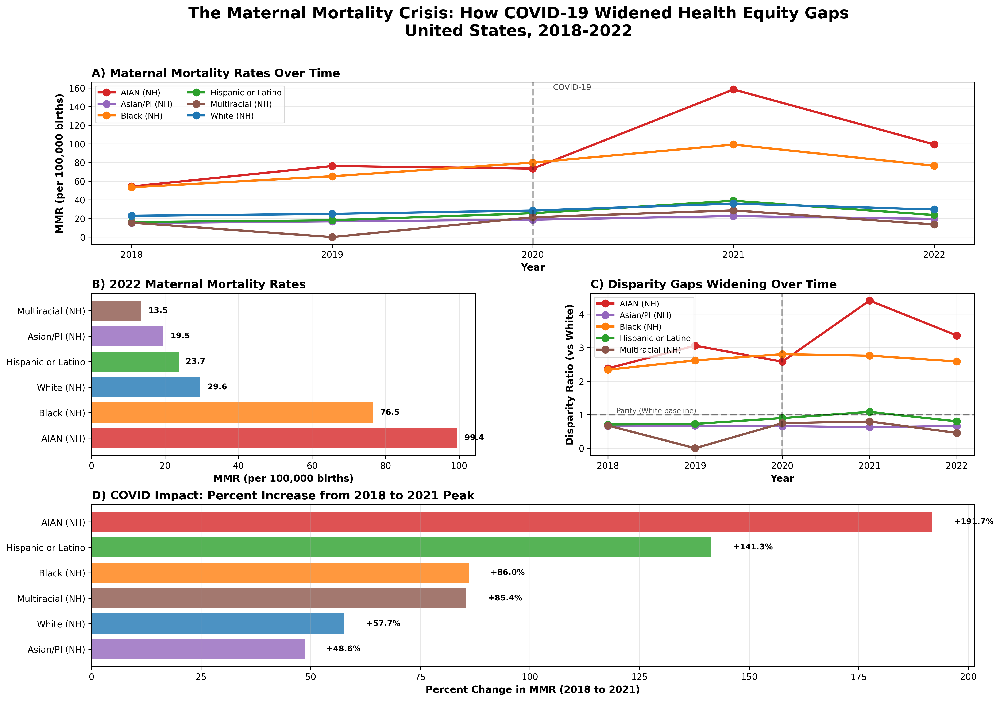
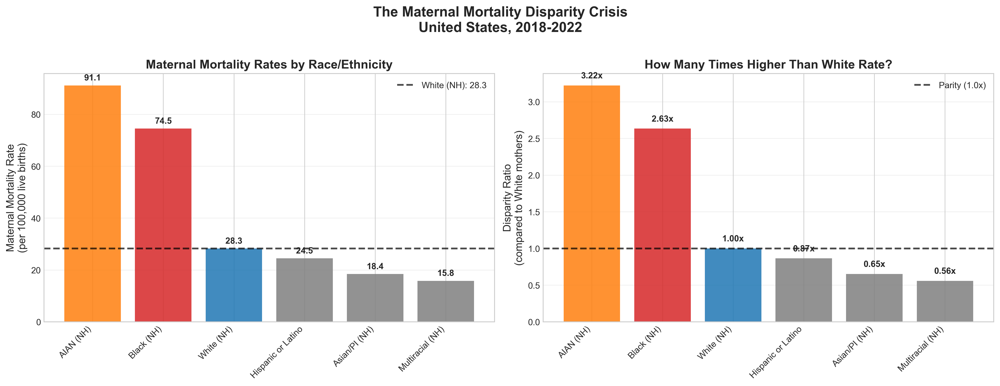

# Maternal Mortality Equity Metrics Dashboard

> Analyzing racial and ethnic disparities in maternal mortality across the United States (2018-2022)

**Part of the [Isosalus](https://isosalus.com) Operational Equity Framework Research Initiative**

---

##  Project Overview

This project provides a comprehensive analysis of maternal mortality disparities in the United States, examining how operational equity gaps contribute to persistent and widening disparities in maternal health outcomes.

Using data from the CDC WONDER database (2018-2022), we analyzed **6,214 maternal deaths** and **19.3 million births** to uncover critical disparities and temporal trends.

---

## 🔍 Key Findings (2018-2022)

Analysis of **6,214 maternal deaths** and **19.3 million births** revealed stark and widening disparities:

### National Disparities (2018-2022)

- **American Indian/Alaska Native mothers**: 91.1 deaths per 100K births (**3.2x White rate**) - Highest disparity
- **Black mothers**: 74.5 deaths per 100K births (**2.6x White rate**)
- **White mothers**: 28.3 deaths per 100K births (baseline)
- **Hispanic mothers**: 24.5 deaths per 100K births (0.87x White rate)
- **Asian/Pacific Islander mothers**: 18.4 deaths per 100K births (0.65x White rate)

### Temporal Trends: COVID-19 Impact

**2021 was the deadliest year**, with maternal deaths increasing **74% from 2018**:

- **AIAN mothers**: +192% increase (54.3 → 158.3 per 100K) - **Disparity widened to 4.4x White rate**
- **Hispanic mothers**: +141% increase (16.1 → 38.9 per 100K) - **Flipped from lower to higher risk than White**
- **Black mothers**: +86% increase (53.3 → 99.2 per 100K)
- **White mothers**: +58% increase (22.8 → 35.9 per 100K)

**The disparity gaps WIDENED during the COVID-19 pandemic, despite universal policy responses.**

##  Policy Context & Timeline

**Analysis Period**: 2018-2022

**Key Policy Developments:**
- **2020-2021**: Emergency COVID-19 provisions (temporary Medicaid coverage, telehealth expansion)
- **April 2022**: American Rescue Plan Act implementation. States begin 12-month postpartum Medicaid coverage extensions
- **2023-2024**: Post-intervention period (data pending CDC release)

**Research Significance:**
This analysis captures the critical pre-intervention baseline, allowing future assessment of whether Medicaid postpartum extensions effectively reduce disparities or if operational infrastructure gaps persist despite the extended policy coverage.

**Hypothesis**: Policy coverage alone (Medicaid extension) will be insufficient without operational infrastructure investments in process re-design, people, and technology. This is evident in the differential COVID-19 outcomes, despite universal policy responses.

---

##  Visualizations

### Comprehensive Dashboard



*Four-panel analysis showing temporal trends, current disparities, widening gaps, and COVID-19 impact*

### Temporal Trends by Race/Ethnicity


*Maternal mortality rates over time, showing 2021 peak and differential impact by race/ethnicity*

### National Disparity Dashboard



*Current state of maternal mortality disparities with focus on operational equity gaps*

---

##  Project Structure
```
equity-metrics-dashboard/
── notebooks/
   ── 01_initial_exploration.ipynb    # National disparity analysis
   ── 02_temporal_trends.ipynb        # Temporal trends & COVID impact
── src/
   ── analysis.py                     # Reusable analytics toolkit
   ── README.md                       # Module documentation
── framework/                         # Project 3
   ── assessment_questions.json       # 60-question assessment
   ── scoring_algorithm.py            # Automated scoring & reporting
   ── framework_methodology.md        # Theoretical foundation
   ── sample_assessment_report.md     # Example deliverable
   ── README.md                       # Assessment tool guide
── data/
   ── raw/                            # CDC WONDER data (not in repo)
── outputs/
   ── comprehensive_dashboard.png
   ── temporal_trends_by_race.png
   ── disparity_dashboard_complete.png
── docs/                               # Documentation (private notes)
── requirements.txt                    # Python dependencies
── README.md                           # This file
```

## Technologies Used

- **Python 3.12**: Core programming language
- **pandas**: Data manipulation and analysis
- **matplotlib & seaborn**: Data visualization
- **NumPy**: Numerical computing
- **Jupyter Notebook**: Interactive analysis and documentation
- **JSON**: Structured data storage for assessment framework
- **Modular architecture**: Reusable functions in `/src` and `/framework` modules

---

##  Getting Started

### Prerequisites

- Python 3.12+
- pip package manager

### Installation

1. **Clone the repository**
```bash
   git clone https://github.com/marshelton3/equity-metrics-dashboard.git
   cd equity-metrics-dashboard
```

2. **Create virtual environment**
```bash
   python3.12 -m venv venv
   source venv/bin/activate  # On Windows: venv\Scripts\activate
```

3. **Install dependencies**
```bash
   pip install -r requirements.txt
```

4. **Download data from CDC WONDER**
   - [Multiple Cause of Death](https://wonder.cdc.gov/mcd.html) (2018-2022)
   - [Natality](https://wonder.cdc.gov/natality.html) (2018-2022)
   - Place files in `data/raw/` directory

5. **Launch Jupyter Notebook**
```bash
   jupyter notebook
```

6. **Open and run notebooks**
   - Start with `01_initial_exploration.ipynb`
   - Then `02_temporal_trends.ipynb`

---

##  Data Sources

**Maternal Mortality Data:**
- Source: CDC WONDER Multiple Cause of Death Database
- Years: 2018-2022
- ICD-10 Codes: O00-O99 (Pregnancy, childbirth and the puerperium)
- Geography: United States (national level)

**Birth Data:**
- Source: CDC WONDER Natality Database
- Years: 2018-2022
- Geography: United States (national level)

**Note**: Raw data files are not included in this repository due to size. Download instructions provided above.

---


##  Methodology

### Rate Calculation
Maternal Mortality Rate (MMR) calculated as:
```
MMR = (Maternal Deaths / Live Births) × 100,000
```

### Disparity Ratios
Calculated relative to White (Non-Hispanic) baseline:
```
Disparity Ratio = (Group MMR / White NH MMR)
```

### Statistical Approach
- Aggregated data by race/ethnicity and year
- Standardized race/ethnicity categories (Hispanic Origin + Race)
- Handled CDC data suppression (counts <10)
- Temporal trend analysis using year-over-year comparisons

---

## 🎯 The Operational Equity Framework

**Project 3 delivers a professional assessment tool** for evaluating health equity operational infrastructure.

This analysis validates the **Operational Equity Framework**: health equity requires operational infrastructure across three equal pillars, not just policy declarations.

### Three Pillars:

**🔄 PROCESS**: Care workflows and service delivery pathways
- Eliminates systemic barriers in how care is delivered
- Includes language access, transportation, scheduling flexibility
- Ensures policies translate to accessible services

**👥 PEOPLE**: Workforce capability, training, and accountability
- Cultural competency and representative workforce
- Equity metrics tied to performance
- Community health workers and peer support

**💻 TECHNOLOGY**: Data infrastructure and monitoring systems
- Real-time outcome stratification by race/ethnicity
- Automated risk alerts and intervention triggers
- Analytics capability to identify and address gaps

### Key Insight from 2018-2022 Analysis:

During COVID-19, **policy coverage expanded universally** (emergency Medicaid, telehealth reimbursement), but communities lacking operational infrastructure experienced the **worst increases** in maternal mortality:
- AIAN: +192% increase
- Black: +86% increase  
- Hispanic: +141% increase

**Conclusion**: Policy declarations ≠ Operational implementation

### Framework Products:
- **60-question comprehensive assessment** - Evaluates organizational infrastructure
- **Automated scoring algorithm** - Identifies priority gaps
- **Gap analysis and recommendations** - Actionable implementation roadmap
- **Evidence-based methodology** - Validated through 2018-2022 maternal mortality analysis
- **Policy readiness evaluation** - Predicts organizational capacity for equity initiatives

**Learn more:** See [`/framework`](framework/) directory for complete documentation.

### Use Cases:
- Health system equity assessments ($5K-15K)
- Implementation roadmap development
- Policy effectiveness evaluation
- Organizational benchmarking
- Pre/post-intervention measurement

##  Future Work

**Upcoming analyses (Projects 4-6):**

- **Project 4**: State-level geographic analysis and policy context
- **Project 5**: Medicaid expansion impact and policy effectiveness
- **Project 6**: Predictive modeling and risk stratification

---

##  Publications & Outputs

**In Development:**
- Paper 1: "Evaluating Medicaid Postpartum Extensions: A Natural Experiment (2018-2024)"
- Paper 2: "Why Some States Succeeded While Others Failed: The Role of Operational Infrastructure"
- Paper 3: "The Operational Equity Framework: Evidence from Maternal Health Policy Implementation"

- Policy Brief 1: State Scorecard (From Project 4)
- Policy Brief 2: Implementation Guide (From Project 5)
- Policy Brief 3: Framework Application

---

##  About

**Marshawn Shelton, MPH, PMP, CCMP**

- Founder, [Isosalus](https://isosalus.com) - Operationalizing Health Equity
- Former health system transformation roles: 
   - Change Manager, **Mercy St. Louis**
   - AI Project Manager, Operations Transformation, **Piedmont Healthcare**
   - Senior Process Improvement Advisor, Perioperative Services, **Grady Health System**
   - Project Manager, Clinical Effectiveness & Quality Improvement, **Penn Medicine**
   - Management Consultant, EHR Modernization, **Guidehouse**

**Connect:**
- LinkedIn: [linkedin.com/in/marshawnshelton](https://linkedin.com/in/marshawnshelton)
- GitHub: [@marshelton3](https://github.com/marshelton3)
- Website: [isosalus.com](https://isosalus.com)


---

##  Acknowledgments

- **CDC WONDER**: For providing public access to vital statistics data
- **Communities affected by maternal mortality disparities**: This work is dedicated to improving outcomes for all mothers.

---

##  Important Notes

**Data Privacy**: All data used is publicly available and de-identified. CDC WONDER suppresses small counts (<10) to protect privacy.

**Interpretation**: Findings represent population-level patterns and should not be used for individual risk assessment.

**Usage**: This analysis is intended for research, education, and policy advocacy purposes.

---

**Last Updated**: November 2025

**Status**: 
 ✅ Project 1 Complete
 ✅ Project 2 Complete
 ✅ Project 3 Complete